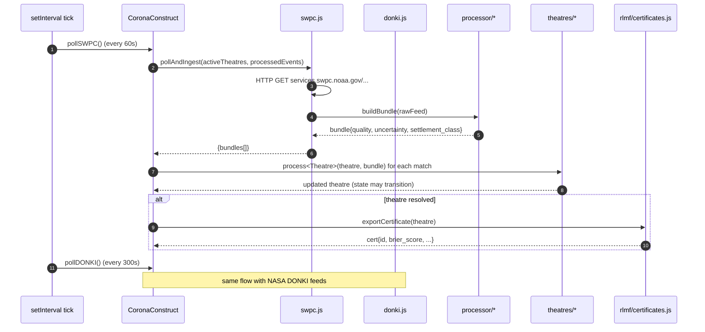
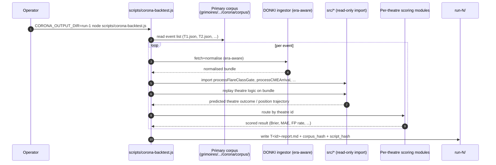
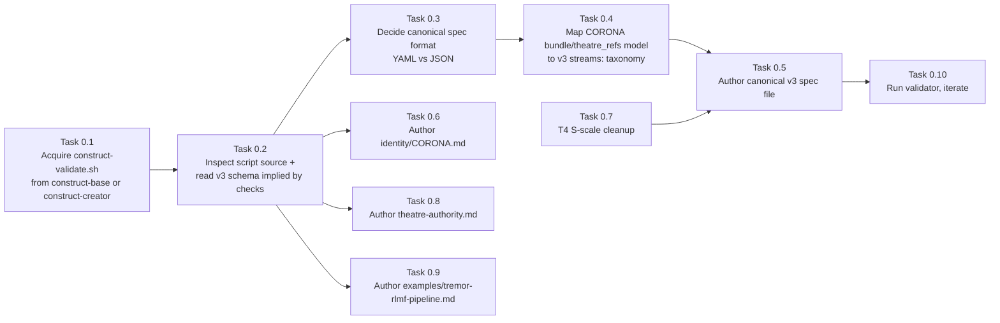
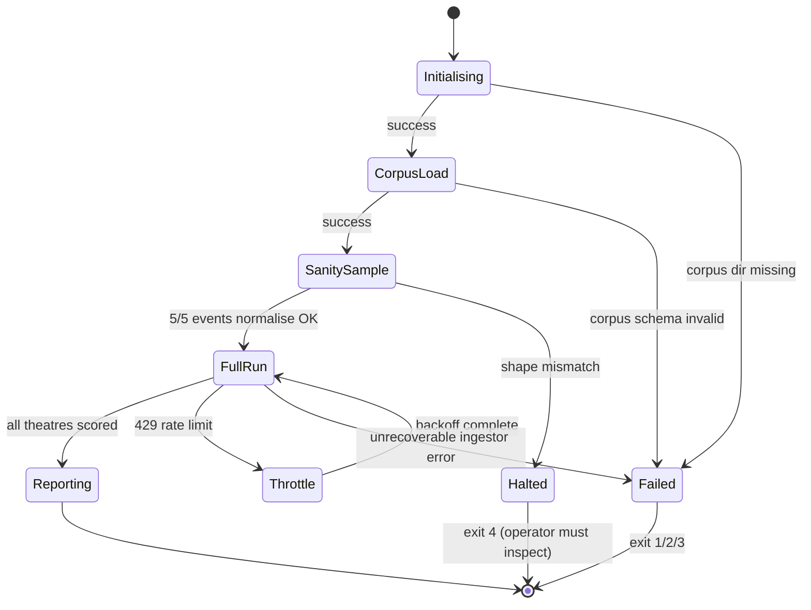

# Software Design Document — CORONA: v3 Construct-Network Readiness + Hybrid Calibration

**Version:** 1.0
**Date:** 2026-04-30
**Author:** Architecture Designer Agent
**Status:** Draft
**PRD Reference:** [grimoires/loa/prd.md](prd.md)

> **Brownfield grounding banner**: This SDD was created without `/ride` codebase analysis. Reality grounding for the `src/` tree is provided by the existing provenance-tagged BUTTERFREEZONE.md (CODE-FACTUAL / DERIVED / OPERATIONAL annotations) and direct file inspection of `spec/`, `src/`, and `package.json`. `/ride` was deliberately skipped on 2026-04-30 because BFZ already substantiates code-grounded claims and the PRD inherits the same grounding policy. If reality drift is suspected at any future point, run `/ride` and `/architect --fresh` to refresh.

> **Operator hard constraints (verbatim from `/architect` invocation)**: Sprint 0 is a **reversible** migration layer; both `spec/construct.json` and `spec/corona_construct.yaml` remain on disk through the design; v3 metadata refactor and calibration logic must have **distinct module boundaries**; all calibration artifacts live under `grimoires/loa/calibration/corona/`; TREMOR composition is a **local reference example, not a runtime dependency**; Echelon theatre-api integration is **out of scope for Sprint 0** (extension point only); validator acquisition is the **first architectural dependency** — schema details remain unbound until the validator is in hand.

---

## Table of Contents

1. [Project Architecture](#1-project-architecture)
2. [Software Stack](#2-software-stack)
3. [Data Model & Persistence](#3-data-model--persistence)
4. [Spec / Manifest Surfaces](#4-spec--manifest-surfaces)
5. [Calibration Subsystem](#5-calibration-subsystem)
6. [Backtest Harness Architecture](#6-backtest-harness-architecture)
7. [Manifest Regression Gate](#7-manifest-regression-gate)
8. [Lightweight Input-Validation Review (Sprint 6)](#8-lightweight-input-validation-review-sprint-6)
9. [Reference Composition with TREMOR](#9-reference-composition-with-tremor)
10. [Error Handling Strategy](#10-error-handling-strategy)
11. [Testing Strategy](#11-testing-strategy)
12. [Development Phases](#12-development-phases)
13. [Known Risks and Mitigation](#13-known-risks-and-mitigation)
14. [Open Questions / Design Extension Points](#14-open-questions--design-extension-points)
15. [Appendix](#15-appendix)

---

## 1. Project Architecture

### 1.1 System Overview

CORONA is a single-process, event-loop Node.js construct that polls two read-only HTTP data sources (NOAA SWPC, NASA DONKI), normalises feeds into evidence bundles, processes those bundles against a fixed roster of 5 prediction-market theatres (T1–T5), and exports RLMF certificates on theatre resolution. The Sprint 0–7 work enlarges this construct **without** changing its runtime topology: all new structure is metadata, calibration artefacts, and a separate offline backtest harness. The runtime construct itself remains a read-only-HTTP, zero-runtime-dependency, single-process program.

> **Source**: BUTTERFREEZONE.md:35-46 (data sources), BUTTERFREEZONE.md:51-72 (architecture diagram), src/index.js:35-322 (`CoronaConstruct` class), package.json:6,32 (Node ≥20, zero runtime deps).

### 1.2 Architectural Pattern

**Pattern**: Layered single-process pipeline, with a side-car offline backtest harness and a side-car calibration manifest. The runtime is **monolithic-by-choice** (single Node process, no IPC, no service mesh); the offline calibration tooling is **separable** (its own script + its own corpus on disk, never imported by runtime code).

**Justification**:
- The PRD scopes new work to metadata refactor, calibration artefacts, and offline parameter fitting — none of these warrant changing runtime topology (PRD §1, §5, §8).
- The zero-runtime-dependency constraint (PRD §8.1; package.json:32) forecloses microservices, message brokers, or external state stores.
- TREMOR's calibration recipe (the closest sibling reference per PRD §13.2) uses the same pattern: runtime construct + offline backtest script + on-disk calibration corpus, no runtime coupling between them. CORONA preserves that separation.

### 1.3 Component Diagram (Target State, Post-Sprint-7)

```mermaid
flowchart TB
    subgraph Runtime["Runtime construct (src/) — unchanged topology, refitted parameters"]
        IDX[index.js<br/>CoronaConstruct] --> POR[Oracles<br/>swpc.js, donki.js]
        IDX --> PROC[Processor<br/>bundles, quality, uncertainty, settlement]
        IDX --> THEAT[Theatres<br/>T1 flare-gate · T2 geomag-gate · T3 cme-arrival<br/>T4 proton-cascade S-scale · T5 sw-divergence]
        IDX --> RLMF[rlmf/certificates.js]
    end

    subgraph SpecLayer["v3 spec layer (spec/ + identity/) — Sprint 0–1"]
        SPECJSON[spec/construct.json<br/>legacy, retained]
        SPECYAML[spec/corona_construct.yaml<br/>legacy, retained]
        V3SPEC[Canonical v3 spec<br/>format TBD post-validator]
        IDENT[identity/CORONA.md<br/>persona]
        ADAPT{{Manifest adapter / shim<br/>read-from-canonical, fall-back-to-legacy}}
        VAL[scripts/construct-validate.sh<br/>acquired Sprint 0]
        SPECJSON -.-> ADAPT
        SPECYAML -.-> ADAPT
        V3SPEC --> ADAPT
        VAL -. validates .-> V3SPEC
    end

    subgraph CalibArtefacts["Calibration artefacts (grimoires/loa/calibration/corona/) — Sprint 1–7"]
        AUTH[theatre-authority.md]
        PROTO[calibration-protocol.md]
        EVID[empirical-evidence.md]
        MANIF[calibration-manifest.json]
        REPORTS[run-N/<br/>per-theatre reports + corpus snapshot]
        FINAL[run-N-final/<br/>final certificates]
        SECREV[security-review.md]
    end

    subgraph BacktestHarness["Offline backtest harness (scripts/) — Sprint 3"]
        BACKTEST[scripts/corona-backtest.js]
        DONKING[DONKI ingestor<br/>era-aware]
        SCORE[Per-theatre scoring modules<br/>T1/T2 bucket-Brier · T3 timing · T5 quality-of-behavior]
        CORPUS[Primary corpus<br/>GOES-R era, 2017+]
        CORPUS2[Secondary corpus<br/>SC24/25 stress events]
        BACKTEST --> DONKING
        BACKTEST --> SCORE
        BACKTEST --> CORPUS
        BACKTEST --> CORPUS2
        BACKTEST --> REPORTS
    end

    subgraph Gate["Regression gate — Sprint 5"]
        GATE[scripts/manifest-regression-check.sh<br/>or pre-commit hook]
        GATE -. enforces inline≡manifest .-> THEAT
        GATE -. reads .-> MANIF
    end

    subgraph RefComp["Reference composition — Sprint 0, NON-runtime"]
        EXAMPLE[examples/tremor-rlmf-pipeline.md<br/>+ optional integration test]
    end

    PROC -. parameters refitted by .-> MANIF
    THEAT -. parameters refitted by .-> MANIF
    BACKTEST -. reads code-under-test from .-> Runtime
    EXAMPLE -. references read-only .-> THEAT

    classDef runtime fill:#dff,stroke:#066,stroke-width:2px
    classDef offline fill:#fed,stroke:#960,stroke-width:1px
    classDef artefact fill:#efe,stroke:#494,stroke-width:1px
    classDef legacy fill:#fee,stroke:#933,stroke-width:1px,stroke-dasharray:3
    class IDX,POR,PROC,THEAT,RLMF runtime
    class BACKTEST,DONKING,SCORE,CORPUS,CORPUS2,GATE,VAL offline
    class AUTH,PROTO,EVID,MANIF,REPORTS,FINAL,SECREV,IDENT,V3SPEC,EXAMPLE artefact
    class SPECJSON,SPECYAML legacy
```



**Reading the diagram**:
- The **Runtime** rectangle is the current `src/` tree. Its topology does not change. Its parameters do (Sprint 5 refit).
- The **SpecLayer** rectangle is Sprint 0–1 work. Both legacy spec files remain; a thin adapter resolves whichever the validator accepts as canonical.
- The **CalibArtefacts** rectangle is exclusively under `grimoires/loa/calibration/corona/`. No alternative paths.
- The **BacktestHarness** rectangle is under `scripts/`. It imports from `src/` read-only at backtest time; runtime never imports from `scripts/`.
- The **RefComp** rectangle (TREMOR composition example) is documentation + optional integration test. Runtime code MUST NOT import or shell-out to TREMOR.

### 1.4 System Components

#### 1.4.1 Runtime construct (`src/`) — preserved

| Submodule | Files | Role | Sprint 0–7 changes |
|-----------|-------|------|---------------------|
| Entry | `src/index.js` | `CoronaConstruct` class, lifecycle, polling timers | None (Sprint 0–4); Sprint 5 may inline-edit theatre constants |
| Oracles | `src/oracles/swpc.js`, `donki.js` | HTTP polling + normalisation | Sprint 5: refitted constants (e.g., flareRank thresholds may stay; doubt-price tunings move); Sprint 6 input-validation tightening per review findings |
| Processor | `src/processor/{bundles,quality,uncertainty,settlement}.js` | Bundle build + quality + uncertainty pricing + settlement class | Sprint 5: refitted uncertainty constants (WSA-Enlil sigma, doubt-price floors, source-reliability scores) |
| Theatres | `src/theatres/{flare-gate,geomag-gate,cme-arrival,proton-cascade,solar-wind-divergence}.js` | T1–T5 logic | Sprint 0: T4 S-scale rename + bucket scaffold cleanup. Sprint 5: refitted thresholds + Wheatland prior + Bz volatility threshold |
| RLMF | `src/rlmf/certificates.js` | Certificate export | None expected |

**Source**: BUTTERFREEZONE.md:75-98 (directory structure), src/index.js:25-32 (imports).

#### 1.4.2 v3 spec layer (`spec/` + `identity/`) — Sprint 0

The v3 spec layer is **introduced**, not migrated-by-deletion. Both legacy files (`spec/construct.json`, `spec/corona_construct.yaml`) remain on disk through the entire cycle. A thin **manifest adapter** resolves the canonical source at read time. The canonical spec format (YAML vs JSON) is decided in Sprint 0 **after** `construct-validate.sh` is acquired and inspected, per PRD §11 and operator hard constraint #1.

See [§4 Spec / Manifest Surfaces](#4-spec--manifest-surfaces) for full design.

#### 1.4.3 Calibration artefact tree — Sprints 1–7

All under `grimoires/loa/calibration/corona/`. No alternative paths. See [§5 Calibration Subsystem](#5-calibration-subsystem).

#### 1.4.4 Backtest harness (`scripts/corona-backtest.js`) — Sprint 3

Offline; imports runtime code read-only; produces per-theatre reports under `grimoires/loa/calibration/corona/run-N/`. See [§6 Backtest Harness Architecture](#6-backtest-harness-architecture).

#### 1.4.5 Manifest regression gate — Sprint 5

Pre-commit hook **or** test-tier mechanism (decision deferred to Sprint 5 implementation). Reads `calibration-manifest.json`, asserts inline parameters in `src/theatres/` and `src/processor/` match. See [§7 Manifest Regression Gate](#7-manifest-regression-gate).

### 1.5 Data Flow

#### 1.5.1 Runtime data flow (unchanged)



> **Source**: src/index.js:144-233 (`pollSWPC`, `pollDONKI`, `_processIngestedBundles`).

#### 1.5.2 Calibration data flow (offline, Sprint 3+)



### 1.6 External Integrations

| Service | Purpose | API Type | Auth | Used by |
|---------|---------|----------|------|---------|
| NOAA SWPC | GOES X-ray, Kp, proton flux, DSCOVR solar wind | REST (JSON) | none | `src/oracles/swpc.js` (runtime) + offline backtest fetch |
| NASA DONKI | Solar flares, CMEs, GST, IPS event labels | REST (JSON) | API key (`NASA_API_KEY` env, falls back `DEMO_KEY`) | `src/oracles/donki.js` (runtime) + `corona-backtest` ingestor |
| GFZ Potsdam | Definitive Kp/Hp index (T2 regression authority) | REST (JSON) | none | Backtest only (T2 regression scoring); not imported by runtime in Sprint 0–7 unless Sprint 5 refit demands it |
| TREMOR | Reference RLMF cert pipeline composition | **NOT a runtime integration** | — | Documentation in `examples/`; optional static integration test ONLY |

> **Sources**: spec/construct.json:29-50 (data sources), PRD §6 (theatre authority — GFZ as T2 regression), operator hard constraint #7 (TREMOR is local reference, not runtime).

### 1.7 Deployment Architecture

CORONA is consumed as a Node ESM module (`@echelon/corona`). It does not own its deployment; Echelon platform integrators import the construct and run it inside their process. The Sprint 0–7 work does not change this — there is no infrastructure-as-code, no container, no service definition. The deliverables are the code repository + the calibration corpus + the calibration manifest.

> **Source**: package.json:9-16 (`main`, `exports`).

### 1.8 Scalability Strategy

Out of scope this cycle. CORONA's load profile is bounded: 1 SWPC poll/min + 1 DONKI poll/5 min + N active theatres (typically O(10)). The backtest harness is one-shot and not on a hot path. PRD non-functional requirements (§8) do not mention load.

### 1.9 Security Architecture

CORONA's attack surface is **read-only HTTP, zero auth, zero deps** (PRD §5.7, §9.2). Security-relevant work in this cycle is:

- **Sprint 6**: Lightweight input-validation review of the three parsers — SWPC parser, DONKI parser, backtest corpus loader. Output: `grimoires/loa/calibration/corona/security-review.md`. Scope strictly bounded per [§8](#8-lightweight-input-validation-review-sprint-6).
- **NOT in scope**: Crypto, auth, secret management, network policy, deep cryptographic audit. Per PRD §9.2.

The `NASA_API_KEY` env var is the only secret material; handling pattern is unchanged from current code (read from env, fall back to `DEMO_KEY`).

> **Source**: spec/construct.json:97-103 (env vars), PRD §5.7 (Sprint 6 scope), PRD §9.2 (deep audit out of scope).

---

## 2. Software Stack

### 2.1 Runtime stack — preserved

| Category | Technology | Version | Justification |
|----------|------------|---------|---------------|
| Language | Node.js | ≥20.0.0 | package.json:6 — preserved per PRD §8.1; LTS line, native `fetch`, `node:test` runner, ES modules |
| Module system | ES modules | — | package.json:5 (`"type": "module"`); existing pattern, do not change |
| Test runner | `node --test` | bundled with Node 20 | README.md:115-122; baseline 60 tests; preserved |
| Runtime deps | **none** | — | package.json:32; PRD §8.1 hard constraint |
| Dev / build deps | **none** | — | No bundler, no transpiler, no linter declared currently. Sprint work MUST NOT introduce one without explicit operator approval |

**New code must respect the zero-deps constraint.** This is load-bearing because:
- Echelon consumers integrate CORONA as a leaf in their dep graph.
- A new runtime dep is a supply-chain attack surface.
- TREMOR (`omori-backtest.js` 1124 lines) and BREATH likewise hold zero runtime deps — preserving symmetry across constructs.

### 2.2 New tooling — Sprint 0

| Category | Technology | Version | Source | Used by |
|----------|------------|---------|--------|---------|
| Spec validator | `construct-validate.sh` | TBD post-acquisition | construct-base **or** construct-creator (Sprint 0 first task — see [§13 R1](#13-known-risks-and-mitigation)) | Sprint 0 (initial validation), Sprint 7 (final validation) |

**The validator is the first architectural dependency.** Schema details for the v3 spec are deliberately unbound in this SDD until the validator is in hand. Sprint 0 task 1 is acquisition; task 2 is inspection; **only then** does schema-rewrite design solidify. See [§4.2](#42-validator-acquisition-procedure-sprint-0).

### 2.3 Backtest tooling — Sprint 3

The backtest harness (`scripts/corona-backtest.js`) is plain Node 20 ES module code. It uses `node:fs`, `node:path`, `node:url`, native `fetch`, and `crypto.createHash` (for `corpus_hash` / `script_hash`). **No new runtime deps**. Mirrors TREMOR's `omori-backtest.js` structure.

> **Source**: TREMOR `scripts/omori-backtest.js:17-19` (uses `node:fs`, `node:path`, `node:url` only).

### 2.4 Manifest gate tooling — Sprint 5

Decision deferred to Sprint 5 implementation: pre-commit hook **or** `node --test` integration test. Both are zero-dep paths. See [§7](#7-manifest-regression-gate) for the trade-off.

---

## 3. Data Model & Persistence

CORONA has no database. All data flows through three persistence surfaces:

### 3.1 In-memory state (runtime)

The `CoronaConstruct` instance owns five Maps and one Array:

```js
this.theatres            // Map<theatreId, Theatre>
this.revisionHistories   // Map<eventId, RevisionEntry[]>
this.processedEvents     // Set<eventDedupKey>
this.certificates        // Array<RLMFCertificate>
this.swpcTimer           // Timer | null
this.donkiTimer          // Timer | null
```

> **Source**: src/index.js:42-57.

The Theatre and Bundle shapes are documented in BUTTERFREEZONE.md:117-124 and src/index.js:325-339 (re-exports). **No schema changes in Sprint 0–7** unless Sprint 0 T4 cleanup mandates one (see [§3.4](#34-t4-s-scale-cleanup-sprint-0)).

### 3.2 On-disk artefacts

| Path | Format | Lifecycle | Sprint owner |
|------|--------|-----------|--------------|
| `spec/construct.json` | JSON | **Retained** through Sprint 7 (legacy reference) | preserved |
| `spec/corona_construct.yaml` | YAML | **Retained** through Sprint 7 (legacy reference) | preserved |
| `<canonical-spec-path>` | YAML or JSON (TBD Sprint 0) | New, written Sprint 0 | Sprint 0 |
| `identity/CORONA.md` | Markdown | New, written Sprint 0 | Sprint 0 |
| `examples/tremor-rlmf-pipeline.md` | Markdown (+optional `.test.js`) | New, written Sprint 0 | Sprint 0 |
| `grimoires/loa/calibration/corona/theatre-authority.md` | Markdown | New, written Sprint 0 | Sprint 0 |
| `grimoires/loa/calibration/corona/calibration-protocol.md` | Markdown | New, written Sprint 2 | Sprint 2 |
| `grimoires/loa/calibration/corona/empirical-evidence.md` | Markdown | New, written Sprint 4 | Sprint 4 |
| `grimoires/loa/calibration/corona/calibration-manifest.json` | JSON (schema in PRD §7) | New, written Sprint 5 | Sprint 5 |
| `grimoires/loa/calibration/corona/security-review.md` | Markdown | New, written Sprint 6 | Sprint 6 |
| `grimoires/loa/calibration/corona/corpus/T<id>.json` | JSON | New, written Sprint 3 | Sprint 3 |
| `grimoires/loa/calibration/corona/run-N/T<id>-report.md` | Markdown | New per run, Sprints 3 + 5 | Sprint 3 / 5 |
| `grimoires/loa/calibration/corona/run-N-final/` | mixed | New, written Sprint 7 | Sprint 7 |
| `BUTTERFREEZONE.md` (or v3 equivalent) | Markdown w/ provenance HTML comments | Refresh Sprint 7 | Sprint 7 |
| `scripts/corona-backtest.js` | Node ESM | New, written Sprint 3 | Sprint 3 |
| `scripts/manifest-regression-check.sh` (or test file) | Shell or `node:test` | New, written Sprint 5 | Sprint 5 |
| `tests/corona_test.js` | Node `node:test` | Existing 60-test baseline + new tests appended | Sprints 0, 5 (extension) |

**Hard constraints**:
- All calibration artefacts under `grimoires/loa/calibration/corona/`. **No alternative paths.** (Operator hard constraint #6.)
- Both legacy spec files retained until validator decides canonical. (Operator hard constraint #2.)

### 3.3 No external persistence

No SQL, no NoSQL, no Redis, no S3, no object store. Backtest corpus is plain JSON files committed to git. RLMF certificates are in-memory until exported by the consumer.

### 3.4 T4 S-scale cleanup (Sprint 0)

Inspection of `src/theatres/proton-cascade.js:1-50` shows the current code uses **R-scale (radio blackout, derived from X-ray flux)** as the cascade-counting threshold, with bucket boundaries `[0-1, 2-3, 4-6, 7-10, 11+]`. PRD G0.12 requires alignment to **NOAA S-scale (proton flux)**.

**Cleanup module boundary** (Sprint 0, code-level):

| File | Rename / change | Touches schema? |
|------|-----------------|-----------------|
| `src/theatres/proton-cascade.js` | Rename `R_SCALE_THRESHOLDS` → `S_SCALE_THRESHOLDS`; switch threshold source from X-ray flux ranking (`flareRank`) to integral proton flux ≥10 MeV crossings; update inline doc comments (lines 17-23) from R-scale to S-scale | Maybe (bucket boundaries TBD per PRD §11) |
| `README.md` | Update T4 description (currently mentions "radio blackouts") | No |
| `spec/construct.json:74-81` | Update T4 `description`, `resolution`, possibly `buckets` | Yes (manifest schema) |
| `spec/corona_construct.yaml` | Update T4 `command` description if changed | Maybe |
| `tests/corona_test.js` | Update tests that pin R-scale terminology | Yes (test fixtures) |

**Bucket boundaries**: PRD §11 defers the post-cleanup boundary list to Sprint 0 (cleanup) → Sprint 2 (binding). Sprint 0 produces a **scaffold** with placeholder boundaries; Sprint 2 binds them to the corpus.

> **Source**: src/theatres/proton-cascade.js:1-50 (current R-scale code), PRD §5.1 G0.12, PRD §11 (T4 boundaries deferred).

---

## 4. Spec / Manifest Surfaces

### 4.1 Reversibility principle

> Operator hard constraint #1: "Sprint 0 is a REVERSIBLE migration layer, not a destructive rewrite."
> Operator hard constraint #2: "Do NOT design Sprint 0 to delete `spec/construct.json` or `spec/corona_construct.yaml`."

The design is:

1. **Add** a v3-compliant canonical spec file (path and format TBD post-validator).
2. **Add** an optional thin manifest adapter shim (see [§4.3](#43-manifest-adapter-shim-sprint-0--optional)).
3. **Retain** both legacy files (`spec/construct.json`, `spec/corona_construct.yaml`) on disk.
4. **Defer** the canonical-format decision (`construct.yaml` vs `construct.json`) to Sprint 0 post-validator-inspection (PRD §11).
5. **Defer** the deletion or aliasing of legacy files to a future cycle (out of scope this cycle).

### 4.2 Validator acquisition procedure (Sprint 0)

**Sprint 0 task ordering**:



**Hard rule**: Tasks 0.4 (canonical spec) and 0.10 (validator green) **block** until tasks 0.1–0.3 are complete. The schema is unbound until then.

**If validator cannot be acquired** (PRD §10 R1): surface as Sprint 0 blocker; do not synthesise a schema from `Construct Creater README.md` alone; stop and request operator decision per PRD §10 R1 mitigation.

> **Source**: PRD §5.1 (Sprint 0 outputs), PRD §10 R1 (validator acquisition risk).

### 4.3 Manifest adapter shim (Sprint 0 — optional)

**Purpose**: Allow downstream tooling (Echelon platform reading construct metadata, validators, BUTTERFREEZONE generation) to read **either** the v3 canonical spec or the legacy spec without duplicating logic.

**Scope decision**: The adapter is **optional**. It is needed if and only if:
- The validator declares the v3 canonical format authoritative AND
- A non-trivial caller still reads from the legacy file in Sprint 0–7 scope.

**If needed, the adapter is a single Node module**:

```
spec/
  construct.json                  # legacy, retained
  corona_construct.yaml           # legacy, retained
  <canonical-v3-spec-file>        # new, format TBD
src/manifest/
  loadConstructManifest.js        # adapter — exports loadConstructManifest() returning a normalised v3 shape
```

The adapter's contract:

```js
// src/manifest/loadConstructManifest.js (sketch)
// Reads in this order: (1) canonical v3 spec file, (2) construct.json, (3) corona_construct.yaml.
// Throws if zero are readable. Returns a v3-shaped object regardless of source.
// Adapter is read-only — it never writes to spec/.
export function loadConstructManifest({ specRoot } = { specRoot: 'spec/' }) { ... }
```

**Constraints**:
- Adapter MUST be zero-dep (no `js-yaml`; if YAML parsing is needed and validator reveals YAML is canonical, write a minimal sub-parser **only if** v3 fields are flat enough — otherwise revisit).
- Adapter is in `src/manifest/`, **not** in `src/processor/` (separation of concerns: spec ≠ runtime data).
- Adapter is consumed by tooling, **not** by the runtime polling path (`CoronaConstruct` class does not need v3 manifest at runtime; it knows its theatre roster through code structure, not through reading the spec).

**If not needed**: skip the adapter; Sprint 0 outputs are spec files only. **Document the skip decision** in `grimoires/loa/calibration/corona/sprint-0-notes.md`.

### 4.4 v3 metadata content (Sprint 0)

Per PRD §8.2 (target state) and `Construct Creater README.md:78-88`. The canonical spec MUST include:

| Field | Source | Sprint 0 acceptance |
|-------|--------|---------------------|
| `schema_version: 3` | New | G0.1 |
| `streams:` block | New (taxonomy mapped per [§4.5](#45-streams-block-mapping-prd-r11)) | G0.2 |
| `composition_paths.calibration: grimoires/loa/calibration/corona/` | New | G0.4 (locked Sprint 1) |
| `commands:` array (5 theatre commands) | Existing in spec/construct.json:13-19 | G0.5 |
| `compose_with: [tremor]` | New | G0.6 |
| `pack_dependencies: []` | New, empty initially | G0.7 |
| Butterfreezone autogen marker | New | G0.9 |

**`compose_with[tremor]` asymmetry handling**: TREMOR is read-only reference. The CORONA spec declares `compose_with: [tremor]`; whether TREMOR reciprocates is **not** required by Sprint 0. Document the asymmetry in `sprint-0-notes.md` per PRD §10 R2 mitigation. Operator hard constraint #7 reinforces: TREMOR composition is local reference, not runtime coupling.

### 4.5 `streams:` block mapping (PRD R11)

PRD §10 R11 flags that v3's stream taxonomy (Intent / Operator-Model in / Verdict / Artifact / Signal out) may not map cleanly to CORONA's existing oracle-bundle model. Sprint 0 dedicates a planning subtask to map:

| v3 stream | CORONA equivalent | Notes |
|-----------|-------------------|-------|
| `intent.in` | Theatre creation parameters (`createFlareClassGate(params)`, etc.) | Operator-driven |
| `operator-model.in` | Bundle ingestion (SWPC + DONKI feeds normalised through `processor/bundles.js`) | Continuous, oracle-derived |
| `verdict.out` | Theatre resolution outcome (`outcome` field on resolved theatre) | Discrete, per-theatre |
| `artifact.out` | RLMF certificate (`src/rlmf/certificates.js`) | Per-resolution |
| `signal.out` | Theatre state-transition events (provisional → resolved → expired logs) | Continuous, observable |

This mapping is documented in `sprint-0-notes.md` and feeds the `streams:` block content. **Mapping decisions are deferred to validator inspection**: the validator may impose stricter shape constraints than the README implies.

---

## 5. Calibration Subsystem

### 5.1 Directory layout (Sprints 1–7)

All calibration artefacts under `grimoires/loa/calibration/corona/`:

```
grimoires/loa/calibration/corona/
├── theatre-authority.md              # Sprint 0 — authority map (Section 6 of PRD)
├── calibration-protocol.md           # Sprint 2 — frozen protocol
├── empirical-evidence.md             # Sprint 4 — literature priors
├── calibration-manifest.json         # Sprint 5 — provenance manifest (PRD §7 schema)
├── security-review.md                # Sprint 6 — input-validation review
├── sprint-0-notes.md                 # Sprint 0 — validator source, asymmetry, T4 cleanup notes
├── corpus/                           # Sprint 3 — frozen event lists per theatre
│   ├── T1-flare.json                 # primary corpus, GOES-R era
│   ├── T2-geomag.json
│   ├── T3-cme-arrival.json
│   ├── T4-proton.json
│   ├── T5-sw-divergence.json
│   ├── secondary-stress.json         # SC24/25 + historical exceptional events
│   └── README.md                     # corpus provenance, hash
├── run-1/                            # Sprint 3 — Run 1 baseline (pre-refit)
│   ├── corpus_hash.txt
│   ├── script_hash.txt
│   ├── T1-report.md
│   ├── T2-report.md
│   ├── T3-report.md
│   ├── T4-report.md
│   ├── T5-report.md
│   ├── per-event/                    # raw scoring JSON per event
│   │   ├── T1-event-001.json
│   │   └── ...
│   └── summary.md
├── run-2/                            # Sprint 5 — Run 2 post-refit
│   └── (same structure as run-1)
└── run-N-final/                      # Sprint 7 — final certificates
    └── (same structure)
```

**Run subdirectory convention** (`run-N/`): a single backtest invocation produces a single `run-N/` directory. N is monotonically increasing. The Sprint 3 baseline is `run-1/`. Sprint 5 post-refit is `run-2/`. Sprint 7 final is `run-N-final/` (where N reflects the actual count). Mirrors TREMOR's `run-1..6/` pattern.

> **Source**: PRD §3.2 GC.1–GC.5, PRD §5.4–5.8, TREMOR `grimoires/loa/calibration/omori-backtest/run-5..6/` pattern.

### 5.2 Per-theatre report templates (Sprint 3)

Each `run-N/T<id>-report.md` follows a fixed template:

```markdown
# T<id> <theatre name> — Run <N> Report

**Run ID**: run-N
**Generated**: <ISO timestamp>
**Corpus hash**: <sha256 of T<id>-<corpus>.json>
**Script hash**: <sha256 of corona-backtest.js>
**Code revision**: <git rev-parse HEAD>

## Inputs
- Corpus file: corpus/T<id>-<theatre>.json
- Code under test: src/theatres/<theatre>.js, src/processor/<modules>.js

## Per-event results
<table or list of N events with predicted, actual, score>

## Aggregate score
<theatre-specific primary metric>
<theatre-specific secondary metric (if applicable)>

## Pass/marginal/fail verdict
<against thresholds defined in calibration-protocol.md>

## Notes
<anomalies, edge cases, ingestor quirks for this theatre>
```

**Per-theatre score code paths are SEPARATE** (operator hard constraint #5). See [§6.4](#64-per-theatre-scoring-modules-no-shared-code-path).

### 5.3 Primary vs secondary corpus distinction

Per PRD §5.3, §8.3:

| Tier | Window | Approx size | Used for |
|------|--------|-------------|----------|
| **Primary** | GOES-R era (2017+) | ~15–25 events per theatre | Parameter fitting, scoring thresholds, regression gates |
| **Secondary** | SC24/25 + exceptional historical | ad hoc | Sanity checks, edge-case coverage; **NOT settlement-critical tuning unless evidence quality matches primary** |

**Implementation**:
- Primary corpus stored at `corpus/T<id>-<theatre>.json` (one file per theatre).
- Secondary stored at `corpus/secondary-stress.json` (one file, multi-theatre, evidence-quality-tagged).
- Backtest harness MUST gate secondary-corpus events behind an evidence-quality flag and exclude them from regression-gate scoring by default.
- `corpus/README.md` documents the gate logic.

### 5.4 Theatre authority map (Sprint 0)

Output: `grimoires/loa/calibration/corona/theatre-authority.md`. Content = PRD §6 verbatim, plus:

- **Provenance citations**: each authority claim cites primary instrument documentation (NOAA SWPC docs, GOES X-ray service docs, GFZ Kp definitive policy docs, DSCOVR mission spec).
- **Cross-references**: links to `calibration-protocol.md` (Sprint 2), where the authority map gates which corpus events are settlement-eligible.
- **DONKI role disclaimer**: explicit "DONKI is NOT a universal settlement oracle — it supplies discovery, labels, correlations, evidence enrichment" text per PRD §6.

The authority map is a **plain markdown document**, not code. It is referenced by the protocol (Sprint 2) and inspected by the security review (Sprint 6).

### 5.5 Calibration manifest schema (Sprint 5)

Per PRD §7. The manifest is a JSON array of entries; each entry has the fields listed in PRD §7. **Implementation note**: the manifest is human-edited in Sprint 5 (initial population) and machine-readable for the regression gate.

**Schema validation**: Sprint 5 includes a `tests/corona_test.js` test that loads the manifest and asserts:
- All required fields present per PRD §7.
- `provisional: true` ⇒ if `settlement_critical: true`, `promotion_path` is non-null.
- `derivation` ∈ {`backtest_derived`, `literature_derived`, `engineering_estimated`}.
- `confidence` ∈ {`high`, `medium`, `low`}.
- `theatre` ∈ {`T1`, `T2`, `T3`, `T4`, `T5`, `shared`}.

This is a **structural** check on the manifest itself. The **inline-vs-manifest** check is the regression gate ([§7](#7-manifest-regression-gate)) and is a **different** layer.

---

## 6. Backtest Harness Architecture

### 6.1 Module structure (`scripts/corona-backtest.js`)

```
scripts/corona-backtest.js          # entrypoint, orchestrator
scripts/corona-backtest/
  ingestors/
    swpc-fetch.js                   # SWPC archive fetch (era-aware)
    donki-fetch.js                  # DONKI archive fetch (era-aware) — see §6.3
    gfz-fetch.js                    # optional GFZ definitive Kp (T2 regression)
    corpus-loader.js                # reads corpus/T<id>.json, validates schema
  scoring/
    t1-bucket-brier.js              # T1 scoring — bucket-Brier on flare class
    t2-bucket-brier.js              # T2 scoring — bucket-Brier on Kp
    t3-timing-error.js              # T3 scoring — MAE in hours, ±6h hit rate
    t4-bucket-brier.js              # T4 scoring — bucket-Brier (post-S-scale cleanup)
    t5-quality-of-behavior.js       # T5 scoring — FP rate + stale-feed latency + satellite-switch behavior
  reporting/
    write-report.js                 # writes run-N/T<id>-report.md
    write-summary.js                # writes run-N/summary.md
    hash-utils.js                   # corpus_hash + script_hash (SHA256)
  config.js                         # paths, env keys (NASA_API_KEY), output dir resolution
```

**Why split into a sub-folder**: TREMOR's `omori-backtest.js` is monolithic (1124 lines). For CORONA, the **5 distinct theatre score paths** demand separation (operator hard constraint #5: T1/T2 bucket-Brier vs T3 timing-error vs T5 quality-of-behavior MUST NOT share scoring code paths). A sub-folder makes that separation enforceable by file boundary and code review.

> **Source**: TREMOR `scripts/omori-backtest.js:1-1124` (monolithic), operator hard constraint #5 (separate scoring paths).

### 6.2 Entry point contract (`scripts/corona-backtest.js`)

```js
// Top-level orchestration only. Imports per-theatre routers.
// Reads corpus, walks events, dispatches to scoring/<theatre>.js, writes reports.
//
// Env:
//   CORONA_OUTPUT_DIR=run-N        (defaults to run-<next>)
//   NASA_API_KEY=<key>             (DONKI auth, falls back to DEMO_KEY with rate-limit warning)
//   CORONA_CORPUS_DIR=<path>       (defaults to grimoires/loa/calibration/corona/corpus/)
//   CORONA_THEATRES=T1,T2,...      (filter; defaults to all)
//
// Exit:
//   0 on success
//   1 on corpus load failure
//   2 on ingestor failure (DONKI rate limit, network)
//   3 on scoring assertion failure
```

Mirrors TREMOR's `OMORI_OUTPUT_DIR` env-var pattern (TREMOR omori-backtest.js:22).

### 6.3 Era-aware DONKI ingestor (`scripts/corona-backtest/ingestors/donki-fetch.js`)

PRD §10 R3: "DONKI archive returns inconsistent shapes across 2017–2026." Sprint 3 mitigation: **5-event sanity sample first**.

**Module contract**:

```js
// donki-fetch.js
// fetchEvent(eventType, eventDate, options)
// - eventType ∈ {'FLR', 'CME', 'GST', 'IPS'}
// - normalises response shape across detected eras
// - returns {era, raw, normalised} OR throws on rate-limit / 404 / shape unknown

// detectEra(responseBody) -> '2017-2019' | '2020-2022' | '2023-2026' | 'unknown'
//   maps known shape variants to era; fail-fast on unknown.
//
// normaliseFLR(raw, era) -> bundle-shaped object
// normaliseCME(raw, era) -> bundle-shaped object
// normaliseGST(raw, era) -> bundle-shaped object
// normaliseIPS(raw, era) -> bundle-shaped object
```

**Sanity-sample harness** (`scripts/corona-backtest/ingestors/donki-sanity.js`): runs **first** in Sprint 3, fetches 5 events spanning 2017→2026, prints normalised output, halts on shape mismatch. **Sprint 3 task ordering**: sanity-sample passes ⇒ full ingestor build proceeds.

> **Source**: PRD §10 R3 mitigation, PRD §5.4 Sprint 3 inputs.

### 6.4 Per-theatre scoring modules (no shared code path)

> **Operator hard constraint #5**: T1/T2 bucket-Brier vs T3 timing-error vs T5 quality-of-behavior MUST NOT share scoring code paths.

**Why**: The metrics are conceptually different. Sharing code would:
- Force premature abstraction (unclear what the shared interface is).
- Risk subtle correctness bugs when a "shared" function evolves.
- Violate the PRD §5.3 "no TREMOR wholesale reuse" principle for thresholds.

**The hard rule**: each `scoring/t<id>-*.js` module is independent and exports a single `scoreEvent(corpusEntry, predictedTrajectory)` function with a theatre-specific result shape.

| Module | Primary metric | Result shape | Notes |
|--------|---------------|---------------|-------|
| `t1-bucket-brier.js` | Bucket-Brier on flare class | `{brier, bucket_calibration, n_events}` | Pattern from TREMOR; thresholds per-theatre (see PRD §5.3) |
| `t2-bucket-brier.js` | Bucket-Brier on Kp | `{brier, gfz_vs_swpc_convergence, n_events}` | GFZ definitive Kp used for regression tier (PRD §6 T2) |
| `t3-timing-error.js` | Arrival-window MAE in hours | `{mae_hours, within_6h_hit_rate, n_events}` | TBD specifics deferred to Sprint 2 (PRD §11) |
| `t4-bucket-brier.js` | Bucket-Brier on S-scale event count | `{brier, n_events}` | Post-Sprint-0-cleanup; bucket boundaries set Sprint 0/2 |
| `t5-quality-of-behavior.js` | FP rate + stale-feed detection latency + satellite-switch behavior | `{fp_rate, stale_feed_p50_seconds, satellite_switch_handled_count, n_events}` | TBD specifics deferred to Sprint 2 (PRD §11) |

**Shared utilities are allowed only for**:
- I/O (write-report.js, hash-utils.js, corpus-loader.js).
- HTTP fetch helpers (used by all ingestors).

**Shared code is FORBIDDEN for**:
- Brier formulas (each theatre owns its own; T1+T2+T4 may have very similar Brier code, but they live in three files — duplication is the lesser evil).
- Bucket boundary definitions (each theatre owns its own).
- Pass/marginal/fail thresholds (each theatre owns its own; pulled from `calibration-protocol.md`).

> **Source**: Operator hard constraint #5, PRD §5.3 ("no TREMOR wholesale reuse"), PRD §8.4.

### 6.5 Hashing (`hash-utils.js`)

```js
// computeCorpusHash(corpusFilePath) -> sha256 of file contents (hex)
// computeScriptHash(scriptFilePath) -> sha256 of file contents (hex)
```

Both written to `run-N/corpus_hash.txt` and `run-N/script_hash.txt`. Recorded in each manifest entry per PRD §7 schema. Uses `node:crypto.createHash('sha256')` — zero-dep.

### 6.6 Authentication & rate limiting (PRD R4)

PRD §10 R4: `DEMO_KEY` is 40 req/hr; authenticated `NASA_API_KEY` is 1000 req/hr. Backtest harness:
- **Reads** `NASA_API_KEY` from env. Falls back `DEMO_KEY` with a console warning.
- **Throttles** at 900 req/hr (90% of authenticated limit) to avoid 429 cliff.
- **Caches** raw DONKI responses to a local JSON file under `corpus/cache/<event-id>.json`. Hash includes cache invalidation token. Cache is `.gitignore`d.
- **Documents** key handling in `grimoires/loa/calibration/corona/corpus/README.md`.

> **Source**: PRD §10 R4 mitigation, spec/construct.json:97-103.

---

## 7. Manifest Regression Gate

### 7.1 Goal

Per PRD §7 source-of-truth rule: "Inline code constants must match manifest values. The Sprint 5 regression gate enforces this."

The gate is a **mechanical inline-equals-manifest check** that fails the build (or commit) if any inline parameter in `src/theatres/` or `src/processor/` diverges from its manifest entry without a corresponding manifest update.

### 7.2 Mechanism — decision matrix

| Approach | Tooling | Pro | Con |
|----------|---------|-----|-----|
| **A — pre-commit hook** | `scripts/manifest-regression-check.sh` invoked from `.git/hooks/pre-commit` | Catches divergence before it lands in HEAD | Requires per-clone `git hooks` setup; bypassable with `--no-verify` |
| **B — `node --test` integration test** | `tests/manifest_regression_test.js` runs in CI on every push | Cannot be bypassed; runs in standard test suite | Catches divergence post-commit |
| **C — both A and B** | Hook for fast feedback + test for hard gate | Defence in depth | More moving parts |

**Recommendation**: **Approach C (both)** — but Sprint 5 **may** ship with B only and add A in Sprint 7 if friction warrants. **Decision deferred to Sprint 5 implementation**, documented in `calibration-manifest.json` accompanying README.

### 7.3 Check semantics

The gate parses the manifest JSON and walks each entry. For each entry where `derivation` ∈ {`backtest_derived`, `literature_derived`}, the gate **must** verify the inline constant in the cited file matches the manifest value.

```js
// tests/manifest_regression_test.js (sketch)
import { test } from 'node:test';
import assert from 'node:assert';
import { readFileSync } from 'node:fs';

test('manifest entries match inline constants', () => {
  const manifest = JSON.parse(readFileSync('grimoires/loa/calibration/corona/calibration-manifest.json', 'utf-8'));
  for (const entry of manifest) {
    if (entry.derivation === 'engineering_estimated') continue; // provisional, may diverge with promotion_path
    const fileContents = readFileSync(entry.evidence_source_inline_file, 'utf-8');
    // Either: assert serialised value appears in file
    //    Or: import the module and assert exported constant === entry.value
    // Strategy: extend manifest schema with `inline_lookup` field {file, exportName} → import + compare.
    assert.ok(
      inlineMatches(fileContents, entry),
      `Inline drift for ${entry.parameter}: manifest=${entry.value}, file=${entry.evidence_source_inline_file}`
    );
  }
});
```

**Schema extension**: PRD §7 manifest schema gains an **inline lookup hint** during Sprint 5. Proposed addition:

```json
{
  "...PRD §7 fields...": "...",
  "inline_lookup": {
    "file": "src/processor/uncertainty.js",
    "export_name": "WSA_ENLIL_SIGMA_HOURS"
  }
}
```

This is a **non-breaking** addition (PRD §7 does not forbid extra fields). Documented in Sprint 5 implementation notes.

### 7.4 Provisional handling

Entries with `derivation: engineering_estimated` AND `provisional: true` are **exempt** from the inline-equals check. The gate instead asserts:

- `promotion_path` is non-null (if `settlement_critical: true`).
- The inline constant exists at the cited location (a "structural" check; value can vary).

### 7.5 Out-of-scope additions

The gate does NOT:
- Validate the *correctness* of the manifest values (that is the backtest's job).
- Enforce manifest completeness (the structural test in [§5.5](#55-calibration-manifest-schema-sprint-5) covers that).
- Run on every PR (it is a pre-commit + node-test check; CI already runs `node --test`).

---

## 8. Lightweight Input-Validation Review (Sprint 6)

### 8.1 Scope (per operator constraint + PRD §5.7)

The Sprint 6 review is **NOT** a deep crypto/auth audit. Surface area is read-only HTTP, zero auth, zero deps. Scope is bounded to **three input parsers**:

1. **SWPC parser** (`src/oracles/swpc.js`)
2. **DONKI parser** (`src/oracles/donki.js`)
3. **Backtest corpus loader** (`scripts/corona-backtest/ingestors/corpus-loader.js`)

### 8.2 Review checklist (per parser)

| Check | SWPC | DONKI | Corpus loader |
|-------|------|-------|---------------|
| Malformed JSON handling (does it crash or recover?) | Y | Y | Y |
| Null/undefined field handling (e.g., null flux, missing `arrivalTime`) | Y | Y | Y |
| Type coercion (string-vs-number, ISO-vs-epoch dates) | Y | Y | Y |
| Numeric overflow (proton flux can be very large) | Y | Y | N/A |
| Date parsing edge cases (leap second, Z vs +00:00) | Y | Y | Y |
| Rate-limit / 429 handling | Y | Y | N/A (local file) |
| Partial response handling (truncated stream) | Y | Y | Y |
| Schema drift detection (DONKI era variance per R3) | N/A | Y | N/A |
| Eclipse-season GOES gap handling | Y | N/A | N/A |
| Satellite-switch (GOES primary→secondary) robustness | Y | N/A | N/A |
| File-system path traversal (corpus loader on user-supplied paths) | N/A | N/A | Y |
| Infinite loop / unbounded recursion in normalisation | Y | Y | Y |
| Memory-bomb resistance (single huge response) | Y | Y | Y |

### 8.3 Output format (`grimoires/loa/calibration/corona/security-review.md`)

```markdown
# CORONA Sprint 6 — Lightweight Input-Validation Review

**Date**: <ISO>
**Reviewer**: <agent or operator>
**Scope**: SWPC parser, DONKI parser, Backtest corpus loader. Out of scope: crypto, auth, secret management, deep code audit.

## Findings (per parser)

### `src/oracles/swpc.js`
| # | Severity | Finding | Recommendation | Status |
|---|----------|---------|----------------|--------|
| S-001 | low | <text> | <text> | open / fixed in Sprint 6 / deferred |
| ... | | | | |

### `src/oracles/donki.js`
<same shape>

### `scripts/corona-backtest/ingestors/corpus-loader.js`
<same shape>

## Critical findings (block Sprint 7?)
<empty if none — per PRD §5.7 acceptance, only critical input-injection / infinite-loop / data-loss vectors block>

## Closed in Sprint 6
<list of fixes shipped in Sprint 6>
```

### 8.4 Severity ladder

- **critical** — input-injection, infinite-loop, data-loss vector. **Blocks Sprint 7** per PRD §5.7 acceptance.
- **high** — crash on plausible malformed input that is not rate-limited.
- **medium** — resource leak, non-graceful degradation.
- **low** — minor robustness improvement.

Findings at high/medium/low **do not** block Sprint 7. They are documented and may be deferred or fixed in Sprint 6 implementation phase.

---

## 9. Reference Composition with TREMOR

### 9.1 Hard constraint

> Operator hard constraint #7: **TREMOR composition is a LOCAL REFERENCE EXAMPLE, not a runtime dependency. CORONA must not import or shell-out to TREMOR at runtime.**

The reference composition is **documentation + example**, optionally a static integration test or example workflow file.

### 9.2 Implementation

#### 9.2.1 `examples/tremor-rlmf-pipeline.md` (Sprint 0)

A markdown document demonstrating the conceptual integration:

```markdown
# TREMOR ⟷ CORONA RLMF Cert Pipeline (Reference Composition)

**Status**: documentation only. CORONA does not import TREMOR at runtime.

## Why this example exists
- v3 G0.10 requires ≥1 reference composition; TREMOR is the closest sibling (shared RLMF schema).
- Demonstrates the certificate-pipeline compatibility declared in spec/construct.json:91-95.

## The conceptual integration
<diagram + 5-step explanation: how a downstream consumer (e.g., Echelon platform) would route certificates from BOTH constructs into the same RLMF training corpus>

## Schema compatibility check
- TREMOR cert schema: <link to TREMOR rlmf module>
- CORONA cert schema: src/rlmf/certificates.js
- Both export `echelon-rlmf-v0.1.0` per spec/construct.json:92.

## Asymmetry note (per PRD §10 R2)
- CORONA declares compose_with: [tremor].
- TREMOR does not currently reciprocate. Per operator direction, this cycle does NOT mutate TREMOR.
- Future cycle: file an issue against TREMOR to add compose_with: [corona].
```

#### 9.2.2 Optional: `tests/integration/tremor-cert-shape.test.js` (Sprint 0)

A static integration test that checks **schema** compatibility without runtime import of TREMOR:

```js
// tests/integration/tremor-cert-shape.test.js (optional, Sprint 0)
// Reads a TREMOR cert fixture (committed alongside this test as a static JSON file
// — NOT fetched from TREMOR at test time) and CORONA's cert export, asserts shape parity.
import { test } from 'node:test';
import assert from 'node:assert';
import { exportCertificate } from '../../src/rlmf/certificates.js';

const TREMOR_FIXTURE = JSON.parse(readFileSync(
  'tests/fixtures/tremor-cert-fixture.json',  // committed as a static snapshot
  'utf-8'
));

test('CORONA cert shape matches TREMOR cert shape', () => {
  const coronaCert = exportCertificate(<resolved theatre fixture>);
  for (const key of Object.keys(TREMOR_FIXTURE)) {
    assert.ok(key in coronaCert, `CORONA cert missing key: ${key}`);
  }
});
```

**Decision**: this test is **optional** and **decided in Sprint 0 implementation**. The committed TREMOR fixture is a frozen snapshot; CORONA never reads TREMOR's repo at test time. Sprint 0 implementation may skip this test if it adds friction; the markdown alone satisfies G0.10.

### 9.3 Echelon theatre-api integration — extension point only

> Operator hard constraint #8: **Echelon theatre-api integration MUST NOT enter the Sprint 0 architecture. It is documented as a future canonical compose target only.**

PRD §11 lists "Echelon theatre-api integration as canonical compose target" as a Future cycle decision.

**Extension point**: leave the `compose_with:` array in the v3 spec **easily extensible** (it is already a list). Document in `sprint-0-notes.md`:

```markdown
## Future canonical compose targets (NOT this cycle)
- Echelon theatre-api: when implemented, add 'echelon-theatre-api' to compose_with:.
  Decision deferred to a future cycle per PRD §11.
- Other constructs (BREATH, future siblings): out of scope this cycle.
```

**No interface, no code, no shim.** Just a list-shaped extension point that is naturally additive.

---

## 10. Error Handling Strategy

### 10.1 Runtime (`src/`) — preserved patterns

The current code uses `console.error` + try/catch around poll handlers (src/index.js:268-269). **Sprint 0–7 do not change error handling philosophy.** Specific tightening from Sprint 6 review may add input validation; that is the only expected change.

### 10.2 Backtest harness (`scripts/corona-backtest.js`)



**Exit code map**:
- 0 — success.
- 1 — corpus load failure.
- 2 — ingestor failure (network, schema unknown).
- 3 — scoring assertion failure (e.g., theatre returned malformed result).
- 4 — sanity-sample halt (operator must inspect; should not happen after Sprint 3 stabilises).

### 10.3 Manifest gate failure

Pre-commit hook prints the offending parameter, manifest value, file location, and inline value. Exits non-zero. Operator either updates the manifest entry (with new evidence) or reverts the inline change.

---

## 11. Testing Strategy

### 11.1 Test runner

`node --test tests/corona_test.js` — the existing single-file 60-test baseline. **Preserved**: this is a hard PRD §8.1 constraint and a CI invariant.

> **Source**: README.md:115-122, package.json:18 (`"test": "node --test tests/corona_test.js"`).

### 11.2 New tests (Sprint by Sprint)

| Sprint | New tests added to `tests/corona_test.js` | Purpose |
|--------|------------------------------------------|---------|
| Sprint 0 | T4 S-scale rename: existing R-scale tests renamed; bucket scaffold has placeholder values that pass smoke checks | Cleanup verification |
| Sprint 0 | (optional) `tests/integration/tremor-cert-shape.test.js` | Reference composition schema check |
| Sprint 3 | Backtest sanity-sample test (one DONKI event normalises end-to-end) | Smoke for ingestor |
| Sprint 5 | `manifest_structural_test.js` — manifest schema validity per PRD §7 | PRD §7 compliance |
| Sprint 5 | `manifest_regression_test.js` — inline-equals-manifest gate | PRD GC.5 |
| Sprint 5 | Refit-parameter delta tests (each refitted theatre has at least one test asserting new threshold/prior is honoured by code) | Refit verification |
| Sprint 7 | Re-run full suite + new tests; expect 60 + N | GF.4 baseline + new |

**All new tests written into the existing single file `tests/corona_test.js`** unless they need fixtures (then they go under `tests/integration/` or `tests/fixtures/`). Single-file convention is the existing pattern.

### 11.3 Tests are NOT a backtest replacement

The 60-test suite tests **runtime correctness** (theatre logic, bundle building, certificate shape). The backtest harness tests **calibration accuracy against historical data**. These are different concerns. The test suite passing does not imply calibration is correct, and a calibration backtest passing does not imply runtime tests pass. Both must hold.

### 11.4 CI

CORONA does not have a `.github/workflows/` directory in the current cycle. **Sprint 7 may** add one if the operator chooses; not required by PRD §3.3 acceptance.

---

## 12. Development Phases

### Phase 1 — Sprint 0: v3 readiness + theatre authority + T4 cleanup (HITL gate ON)

- [ ] Acquire `construct-validate.sh` (R1)
- [ ] Inspect validator + decide canonical spec format (PRD §11)
- [ ] Map CORONA bundle/theatre_refs to v3 streams taxonomy (R11)
- [ ] Author canonical v3 spec (do NOT delete legacy files)
- [ ] Author `identity/CORONA.md`
- [ ] T4 S-scale rename + bucket scaffold (PRD G0.12)
- [ ] Author `theatre-authority.md` (PRD §6 verbatim + provenance)
- [ ] Author `examples/tremor-rlmf-pipeline.md` + asymmetry note
- [ ] BFZ marker for CONSTRUCT-README.md autogen
- [ ] (Optional) Manifest adapter shim (`src/manifest/loadConstructManifest.js`)
- [ ] Run validator: green
- [ ] **HITL gate**: operator confirms before Sprint 1

### Phase 2 — Sprint 1: composition_paths spec + scaffolding (HITL gate ON)

- [ ] Lock `composition_paths.calibration: grimoires/loa/calibration/corona/` in canonical spec
- [ ] Scaffold all calibration artefact placeholder files
- [ ] Validator green
- [ ] **HITL gate**: operator confirms before Sprint 2; **revisit Sprint 2–7 autonomous-execution decision**

### Phase 3 — Sprint 2: frozen calibration protocol

- [ ] Author `calibration-protocol.md` (per-theatre scoring rules, pass/marginal/fail, settlement authority cross-reference)
- [ ] Bind T3 timing-error metric specifics (PRD §11)
- [ ] Bind T5 quality-of-behavior specifics (PRD §11)
- [ ] Bind T4 bucket boundaries to corpus (PRD §11)
- [ ] Operator review

### Phase 4 — Sprint 3: backtest harness

- [ ] Build sanity-sample DONKI fetcher; run 5-event sanity (R3 mitigation)
- [ ] Build full ingestors (SWPC, DONKI, GFZ-optional)
- [ ] Build per-theatre scoring modules (separate code paths — operator hard constraint #5)
- [ ] Build reporting (write-report, write-summary, hash-utils)
- [ ] Commit primary corpus
- [ ] Run baseline: write `run-1/` certificates

### Phase 5 — Sprint 4: research doc

- [ ] Author `empirical-evidence.md` (covers WSA-Enlil sigma, doubt-price floors, Wheatland prior, Bz volatility threshold, source-reliability scores, uncertainty pricing constants)
- [ ] Operator review

### Phase 6 — Sprint 5: refit + manifest + regression gate

- [ ] Refit theatre + processor parameters from Run 1 results + Sprint 4 evidence
- [ ] Inline-edit `src/theatres/*.js` and `src/processor/*.js`
- [ ] Author `calibration-manifest.json` with full provenance
- [ ] Build `manifest_structural_test.js`
- [ ] Build `manifest_regression_test.js` (and optional pre-commit hook)
- [ ] Run Run 2: write `run-2/` certificates
- [ ] Per-theatre delta report

### Phase 7 — Sprint 6: input-validation review

- [ ] Walk SWPC parser, DONKI parser, corpus loader through checklist (§8.2)
- [ ] Author `security-review.md`
- [ ] Fix critical findings (block Sprint 7) inline
- [ ] Defer/document non-critical findings

### Phase 8 — Sprint 7: validate + BFZ + final certificates + tag

- [ ] Run `construct-validate.sh` against post-calibration spec: green
- [ ] Refresh BUTTERFREEZONE.md (or v3 equivalent) with post-calibration provenance
- [ ] Final corpus run: write `run-N-final/`
- [ ] Bump `package.json` to `0.2.0`
- [ ] Run full test suite (60 baseline + new)

---

## 13. Known Risks and Mitigation

The PRD §10 risks (R1–R11) carry forward as **design mitigations** below.

| # | Risk | PRD source | Probability | Impact | Design mitigation |
|---|------|-----------|-------------|--------|-------------------|
| R1 | `construct-validate.sh` not found in construct-base/construct-creator | PRD §10 | Med | High | [§4.2](#42-validator-acquisition-procedure-sprint-0): Sprint 0 task 0.1 is acquisition. Hard rule: schema-rewrite tasks BLOCK on validator. If unavailable: surface as Sprint 0 blocker, do NOT synthesise schema from README alone. |
| R2 | TREMOR's `compose_with` doesn't reciprocate | PRD §10 | Med | Low | [§9](#9-reference-composition-with-tremor): operator hard constraint #7 — TREMOR is read-only reference. Document asymmetry in `sprint-0-notes.md`. Do not mutate TREMOR. |
| R3 | DONKI archive shape variance across 2017–2026 | PRD §10 | High | Med | [§6.3](#63-era-aware-donki-ingestor-scriptscorona-backtestingestorsdonki-fetchjs): era-aware ingestor + 5-event sanity-sample first. Halt on shape mismatch (exit code 4). |
| R4 | DONKI rate limit (DEMO_KEY 40 req/hr) bottleneck | PRD §10 | Med | Med | [§6.6](#66-authentication--rate-limiting-prd-r4): authenticated `NASA_API_KEY`, throttle at 900/hr, local cache. |
| R5 | GFZ Kp definitive lag (~30 days) | PRD §10 | Cert | Low | [§5.4](#54-theatre-authority-map-sprint-0): T2 regression tier excludes events from last 30 days; document in `calibration-protocol.md`. |
| R6 | DSCOVR launched Feb 2015; pre-2015 events lack L1 | PRD §10 | Cert | Low | [§5.3](#53-primary-vs-secondary-corpus-distinction): primary corpus is GOES-R era (2017+); pre-2015 events excluded by tier. |
| R7 | v3 schema may evolve mid-cycle | PRD §10 | Med | Med | [§4.4](#44-v3-metadata-content-sprint-0): record schema commit hash in `pack_dependencies` if applicable; revisit Sprint 7. |
| R8 | T3 timing-error specifics TBD | PRD §10 | Cert | Low | [§14](#14-open-questions--design-extension-points) extension point: Sprint 2 owns metric definition. Sprint 0/1 do not block on it. Backtest module `t3-timing-error.js` written Sprint 3 against Sprint 2-frozen spec. |
| R9 | T5 quality-of-behavior specifics TBD | PRD §10 | Cert | Low | Same as R8; `t5-quality-of-behavior.js` written Sprint 3 against Sprint 2-frozen spec. |
| R10 | T4 S-scale code-vs-naming inconsistency | PRD §10 | High | Low | [§3.4](#34-t4-s-scale-cleanup-sprint-0): Sprint 0 first inspects `src/theatres/proton-cascade.js` before deciding cleanup scope. The current code uses R-scale; cleanup scope is real and bounded. |
| R11 | v3 `streams:` taxonomy may not map cleanly to bundle model | PRD §10 | Med | Med | [§4.5](#45-streams-block-mapping-prd-r11): Sprint 0 dedicates a planning subtask to map CORONA's `bundles` / `theatre_refs` model onto v3 stream taxonomy before schema rewrite. Mapping documented in `sprint-0-notes.md`. |
| **D1** (new) | Manifest adapter shim adds untested code path | This SDD §4.3 | Med | Low | Adapter is OPTIONAL; skip if no consumer needs it Sprint 0–7. Document skip decision in `sprint-0-notes.md`. If built: zero-dep, single-file, included in 60-test baseline extension. |
| **D2** (new) | Per-theatre scoring duplication invites drift | This SDD §6.4 | Med | Low | Duplication is intentional (operator hard constraint #5). Mitigation: `tests/corona_test.js` includes a structural check that each scoring module exports a `scoreEvent(corpusEntry, predictedTrajectory)` function with the documented result shape. |
| **D3** (new) | Pre-commit hook bypassable via `--no-verify` | This SDD §7.2 | High | Low | Recommend Approach C ([§7.2](#72-mechanism--decision-matrix)): hook + `node --test`. The `node --test` path is non-bypassable and runs in CI. |

---

## 14. Open Questions / Design Extension Points

PRD §11 deferred decisions are carried forward here as **design extension points**, NOT pre-decided. Each has a clear owner sprint and a fail-safe default.

| # | Question | Owner sprint | Default if deferred | Extension point in this design |
|---|----------|--------------|----------------------|--------------------------------|
| Q1 | Canonical spec format (`construct.yaml` vs `construct.json`) | Sprint 0 (post-validator) | YAML if validator expects YAML; both legacy files retained | [§4.1](#41-reversibility-principle): canonical-format decision deferred; both legacy files retained |
| Q2 | T3 arrival-window scoring metric specifics | Sprint 2 | MAE in hours + within-±6h hit rate (PRD §8.4) | [§6.4](#64-per-theatre-scoring-modules-no-shared-code-path): `t3-timing-error.js` has frozen interface but TBD internal metric; Sprint 2 binds it |
| Q3 | T5 false-positive / stale-feed / satellite-switch metric specifics | Sprint 2 | FP rate + stale-feed latency + satellite-switch behavior (PRD §8.4) | [§6.4](#64-per-theatre-scoring-modules-no-shared-code-path): `t5-quality-of-behavior.js` has frozen interface but TBD internal metric; Sprint 2 binds it |
| Q4 | T4 S-scale bucket boundaries | Sprint 0 (cleanup) → Sprint 2 (binding) | Sprint 0 produces scaffold; Sprint 2 binds to corpus | [§3.4](#34-t4-s-scale-cleanup-sprint-0): Sprint 0 produces placeholder; Sprint 2 binds |
| Q5 | Full autonomous execution mode for Sprints 2–7 | Revisit post-Sprint-1 | HITL until authority map / T4 / validator / paths locked | Phase gates in [§12](#12-development-phases) reflect this; Sprint 1 closing review revisits |
| Q6 | Echelon theatre-api integration as canonical compose target | Future cycle | Documented as future canonical, not Sprint 0 | [§9.3](#93-echelon-theatre-api-integration--extension-point-only): no concrete code or interface; `compose_with:` is naturally extensible |
| Q7 | Engineering-estimated parameter promotion deadline (per-param vs global) | Sprint 5 | Per-parameter `promotion_path`; no global deadline | [§5.5](#55-calibration-manifest-schema-sprint-5) + [§7.4](#74-provisional-handling): per-entry `promotion_path` field; gate exempts provisional entries from inline-equals check |
| Q8 | `compose_with:` symmetry — TREMOR-side reciprocate or accept asymmetric | Sprint 0 (after reading TREMOR spec) | Accept asymmetric this cycle; do not mutate TREMOR | [§9.1](#91-hard-constraint), [§13 R2](#13-known-risks-and-mitigation): asymmetry documented in `sprint-0-notes.md` |
| **Q9** (new) | Manifest regression gate mechanism (hook vs test vs both) | Sprint 5 | Both (defence in depth) | [§7.2](#72-mechanism--decision-matrix): explicit decision matrix |
| **Q10** (new) | Should `tests/integration/tremor-cert-shape.test.js` ship in Sprint 0 | Sprint 0 implementation | Skip; markdown alone satisfies G0.10 | [§9.2.2](#922-optional-testsintegrationtremor-cert-shapetestjs-sprint-0): test is optional |
| **Q11** (new) | Should the manifest adapter shim ship in Sprint 0 | Sprint 0 implementation | Skip if no consumer requires it Sprint 0–7 | [§4.3](#43-manifest-adapter-shim-sprint-0--optional): adapter is optional |

---

## 15. Appendix

### A. Glossary

See PRD §12. No new terms introduced by this SDD beyond the design-internal terms (e.g., "manifest adapter shim", "era-aware ingestor", "manifest regression gate").

### B. References

#### B.1 Internal

- [grimoires/loa/prd.md](prd.md) — PRD this SDD implements
- [BUTTERFREEZONE.md](../../BUTTERFREEZONE.md) — code-grounded reality with provenance tags
- [README.md](../../README.md) — current construct overview
- [spec/construct.json](../../spec/construct.json) — current canonical metadata
- [spec/corona_construct.yaml](../../spec/corona_construct.yaml) — partial reference metadata
- [src/index.js](../../src/index.js) — construct entrypoint
- [package.json](../../package.json) — runtime constraints
- [grimoires/loa/context/Construct Creater README.md](context/Construct%20Creater%20README.md) — v3 schema reference

#### B.2 External (read-only sibling references)

- TREMOR `scripts/omori-backtest.js` (`C:\Users\0x007\tremor\scripts\omori-backtest.js`, 1124 lines) — closest sibling backtest harness pattern
- TREMOR `grimoires/loa/calibration/omori-backtest-protocol.md` (`C:\Users\0x007\tremor\grimoires\loa\calibration\omori-backtest-protocol.md`, 230 lines) — protocol pattern
- BREATH `grimoires/loa/empirical-validation-research.md` (`C:\Users\0x007\breath\grimoires\loa\empirical-validation-research.md`, 530 lines) — literature-research pattern

#### B.3 Standards / authoritative docs

- NOAA Space Weather Scales (S-scale, R-scale, G-scale): https://www.swpc.noaa.gov/noaa-scales-explanation
- NASA DONKI API: https://api.nasa.gov/ (DONKI section)
- GFZ Kp index policy: https://kp.gfz-potsdam.de/
- WSA-Enlil model documentation (NOAA SWPC): https://www.swpc.noaa.gov/products/wsa-enlil-solar-wind-prediction
- Wheatland 2001 — solar flare waiting-time distribution (cited Sprint 4 evidence; full citation in `empirical-evidence.md`)

### C. Design decision log

| # | Decision | Rationale | Source |
|---|----------|-----------|--------|
| D-01 | Both legacy spec files (`spec/construct.json`, `spec/corona_construct.yaml`) **remain** through Sprint 7 | Operator hard constraint #2; reversibility principle; PRD §11 canonical format decision deferred to Sprint 0 post-validator | Operator instruction; PRD §11 |
| D-02 | Validator acquisition is the **first** architectural dependency | Operator hard constraint #4; schema unbound until validator inspected | Operator instruction; PRD §10 R1 |
| D-03 | All calibration artefacts under `grimoires/loa/calibration/corona/` — **no** alternative paths | Operator hard constraint #6; PRD §3.2, §5.3–5.8 | Operator instruction |
| D-04 | TREMOR composition is local reference example, **not** runtime dependency | Operator hard constraint #7 | Operator instruction |
| D-05 | Echelon theatre-api integration is **out** of Sprint 0 scope; extension point only | Operator hard constraint #8; PRD §9.2, §11 | Operator instruction |
| D-06 | Per-theatre scoring modules have **separate** code paths (no shared scoring functions across T1/T2 vs T3 vs T5) | Operator hard constraint #5; metrics conceptually distinct; mirrors PRD "no TREMOR wholesale reuse" | Operator instruction; PRD §5.3 |
| D-07 | v3 metadata refactor and calibration logic have **distinct module boundaries** (path-tree separation acceptable, code coupling forbidden) | Operator hard constraint #5 | Operator instruction |
| D-08 | Manifest adapter shim is **optional** | Reversibility; YAGNI; only build if a consumer needs it Sprint 0–7 | This SDD §4.3 |
| D-09 | Backtest harness in `scripts/corona-backtest/` sub-folder, not single-file like TREMOR | 5 distinct theatre score paths warrant separation; CORONA scoring is more heterogeneous than TREMOR's single bucket-Brier | TREMOR pattern + operator hard constraint #5 |
| D-10 | T4 cleanup is real refactor (R-scale → S-scale) | `src/theatres/proton-cascade.js:17-50` confirms current code uses R-scale; PRD G0.12 mandates S-scale | Direct file inspection; PRD §5.1 G0.12 |
| D-11 | Sprint 6 review is **input-validation only**; not deep audit | PRD §5.7, §9.2; surface area is read-only HTTP zero-auth | PRD §5.7 |
| D-12 | Manifest regression gate may use **both** pre-commit hook + node-test (defence in depth) | Hook bypassable; node-test is non-bypassable but post-commit | This SDD §7.2 |
| D-13 | All new tests written into existing `tests/corona_test.js` single file | Existing pattern (60 tests, 21 suites); preserves CI invariant | README.md:115-122; package.json:18 |

### D. Change Log

| Version | Date | Changes | Author |
|---------|------|---------|--------|
| 1.0 | 2026-04-30 | Initial SDD | Architecture Designer Agent |

---

*Generated by Architecture Designer Agent — grounded in `grimoires/loa/prd.md`, `BUTTERFREEZONE.md`, `spec/construct.json`, `spec/corona_construct.yaml`, `src/index.js`, `src/theatres/proton-cascade.js`, `package.json`, TREMOR (read-only reference), BREATH (read-only reference), and operator hard constraints from the `/architect` invocation.*
